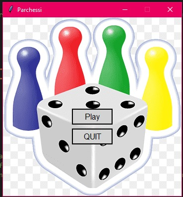
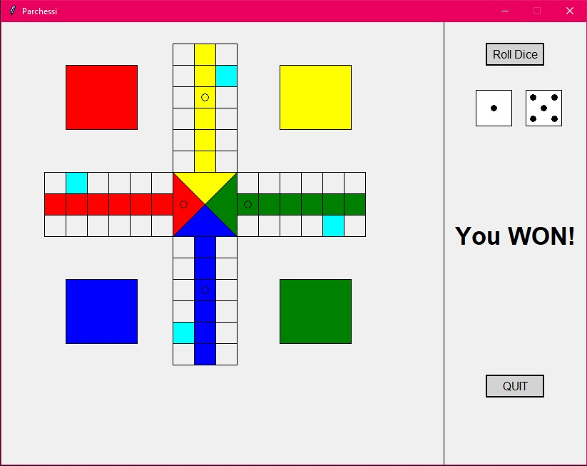

# rodriguez_121351_perez_118130_FinalProject
This code was created by Elimelec Rodriguez and Cedric Perez as a final project for our course CECS 3210 Advanced Programming. 
All the work presented was done by both of the integrants of the group and was pushed onto this specific github repository: CreatorMelec.
The following is based on a game similar to Parcheesi or Trouble, that involves four players with their own specific colors,
moving around a designated board until they reach their home base. Each player has one chip at their disposal,
that can only leave their base when they roll a 5 on a die. All players are given two dies. If either one is a 5, they begin to move on the board.
Once a player moves if they land on a position on the board that is occupied by another player, the player eats the previous player and they are returned to their base.
Once a player has moved a total of 54 steps, they begin their process onto their home row. They must roll the exact number needed to reach their home.
The first player to reach their home, WINS.

This code presents elements such as inheritance with its board and dices, so that you may customize the color of each player's base and the color of the pips for each die.

Future work: 
For this code to be an almost exact replica of the traditional board game, Parcheesi or Trouble:
1. There should be added 3 more available chips to each player.
2. If a player has a chip outside of their base and rolls a 5, they get to choose whether they move a new chip out of base or their existing chip on the board.
3. When a player rolls the die, they get to choose which of their existing chips moves on the board.

